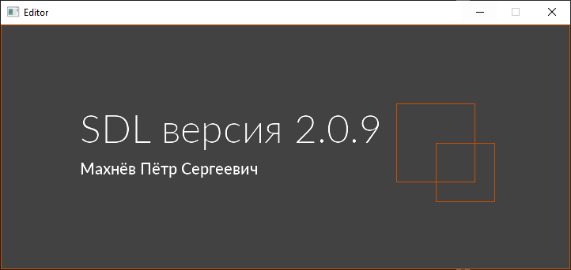

# Лабораторная работа №1 {#sec:chapter1}

## Цель работы

Изучить основные функции библиотеки SDL2.0, разобраться с проектированием простейших приложений с графическим интерфейсом

## Задание

1. Подключить SDL 2.0 и вывести на экран любимую геометрическую фигуру, а также текст с ФИО автора и версией SDL. Версию SDL получать при помощи `SDL_GetVersion()`.

Работа выполняется на языке С++. Программа обязательно должна содержать пользовательские класс(ы). Например, класс 1 содержит инициализацию SDL и основной цикл обработки сообщений, класс 2 содержит инициализацию окна приложения, отрисовку и т.д., класс 3 содержит способ заполнения текстур для отрисовки. Функия main обязательно должна содержать только одну строчку пользовательского кода. Все сообщения на русском языке.


## Результат выполненной работы

В результате работы была написана программа удовлетворяющая условиям задания.

Было создано 4 класса.

1. Класс App:

Реализует логику программы, содержит инициализацию SDL и основной цикл обработки сообщений. 

Ниже представлен заголовочный файл класса.

Файл **app.h**
```c
#pragma once

#include "../sdl_headers/sdl_headers.h"
#include "../window/main-window/main_window.h"

#include "iostream"
using namespace std;

class App
{

public:
	static App* get_instance();
	~App();

private:
	MainWindow* main_window;

private:
	static App* instance;
	App();

private:
	bool running;
	SDL_Event e;


public:
	bool init();
	void setup();
	void update();
	void on_event();
	void quit();

	int run();
};
```

2. Класс Window:

Базовый класс для всех окон приложения, реализующий абстракцию над `SDL_Window` и `SDL_Renderer`.

Ниже представлен заголовочный файл класса.

Файл **window.h**
```c
#pragma once

#include "../sdl_headers/sdl_headers.h"


#include "iostream"
using namespace std;

class Window
{
protected:
	SDL_Rect size;
	string title;

	Uint32 flags;

	SDL_Window* window;
	SDL_Renderer* renderer;

	SDL_Point mouse;

	bool display;

public:
	Window(string title, SDL_Rect size, Uint32 flags);
	~Window();

public:
	bool init();
	virtual void setup() = 0;
	virtual void update() = 0;

	void show();
	void hide();
	bool is_show();

	void close();

	SDL_Rect get_size();
	SDL_Renderer* get_renderer();
	SDL_Window* get_window();
};
```

3. Класс MainWindow, производный от Window:

Класс реализующий главное окно программы. Класс реализует в себе добавление элементов и их отображение.

Ниже представлен заголовочный файл класса.

Файл **main_window.h**
```c
#pragma once

#include "../window.h"
#include "../../label/label.h"
#include "vector"
#include "string"

class MainWindow : public Window
{
private:
	vector <WLabel*> labels;

public:
	MainWindow(string title, SDL_Rect sizes, Uint32 flags);

public:
	void setup();
	void update();
};
```

4. Класс WLabel:

Класс представляющий из себя виджет Надписи.

Ниже представлен заголовочный файл класса.

Файл **label.h**
```c
#pragma once

#include "../sdl_headers/sdl_headers.h"


#include "iostream"
using namespace std;

class WLabel
{

private:
	SDL_Rect size;

	SDL_Texture* texture;

	SDL_Renderer* renderer;
	SDL_Texture* parent_target;

	SDL_Texture* text_texture;
	SDL_Rect text_rect;
	string text;
	TTF_Font* font;

public:
	WLabel(SDL_Renderer* renderer, SDL_Texture* parent_target, string text, SDL_Rect size, string path, int font_size);

private:
	void init();
	void render_text(string text, SDL_Rect place);

public:
	void render();

};
```

Программа была протестирована, далее представлен снимок экрана с работающей программой.



Рисунок 1 --- Демонстрация работы программы 

