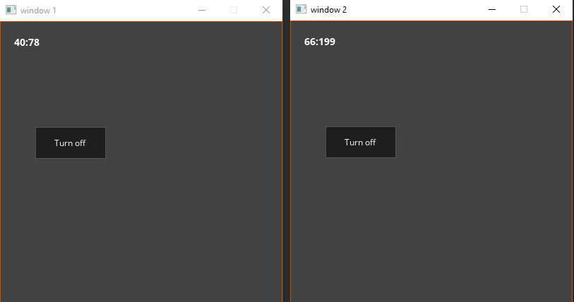
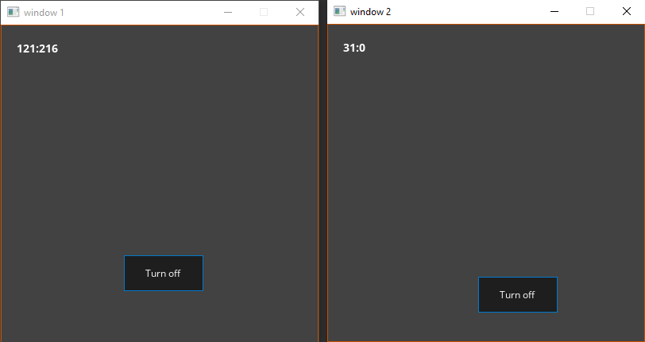

# Лабораторная работа №2 {#sec:chapter1}

## Цель работы

Изучить основные события библиотеки SDL2.0, разобраться с проектированием простейших приложений с графическим интерфейсом с использованием классов

## Задание

1. В файле l2.c приведен текст программы: разобраться и устранить возможные ошибки, проанализировать виды событий и причины их срабатывания.
2. В программе перевести все сообщения на русский язык.
3. Изменить логику построения и структуру программы взяв за основу ЛР 1.
4. На основе полученных знаний написать программу, создающую два окна. В первом фиксируются движение мыши по экрану, во втором выводятся координаты положения курсора и наоборот. В каждом окне имеется кнопка, включающая/отключающая слежение за мышью с выводом соответствующего сообщения.
5. Реализовать возможность перемещения кнопки в пределах окна.

## Результат выполненной работы

В программе были обнаружены следующие ошибки:

1. `164. event.window.windowID = SDL_GetWindowID(param);`, param --- void* явно не приводится к SDL_Window*
2. `177. SDL_HideWindow(param);`, param --- void* явно не приводится к SDL_Window*

Ошибки были устранены.

Каждое из событий было проанализированно, каждоое событие было связано с определенным событием SDL2.

Все сообщения были переведены на русский.

Взяв за основу 1 лабораторную работу, программа была написана в объектно-ориентированном стиле. 

файл main с основной функцией теперь вглядит так:
```c++
#include "app.h"

int main(int argc, char** argv)
{
    setlocale(LC_ALL, "Ru");
    App app;
    return app.run();
}
```

а все приложение было описано в классе App:
```c++
#pragma once

#include "iostream"

#if defined(_WIN32) || defined(_WINDOWS)
#include "SDL.h"
#else
#include "SDL2/SDL.h"
#endif

class App
{
private:
	SDL_Window* window;
	SDL_Renderer* renderer;
	SDL_Event e;

	bool running;

	SDL_TimerID repeatOnceFunctionTimer;
	SDL_TimerID customEventFunctionTimer;

public:
	App();
	~App();

private:
	bool init();
	void setup();
	void update();
	void on_event();
	void quit();

public:
	int run();

private:
	bool createTimers();
	static void clearScreen(SDL_Window* window);


	static Uint32 repeatOnceFunction(Uint32 interval, void* param);
	static Uint32 customEventFunction(Uint32 interval, void* param);

	static int asmFunction();

	static int eventFilter(void* userdata, SDL_Event* event);
};

```

Программа работает и выполняет те же функции, как и приведенная в вложеном файле l2.c


На основе полученных знаний была написана программа для пункта 4. 

Основные классы приложения:

1. Editor --- класс реализующий всю логику приложения
2. Window --- класс реализующий абстракцию окна
3. MainWindow --- класс реализующий главное окно (наследуется от Window)
4. UserEvent --- класс реализующий события пользователя (нажатие кнопки)
5. Widget --- класс реализующий элемент управления
6. WButton --- класс реализующий кнопку (наследуется от Widget)
7. WLabel --- класс реализующий надпись (наследуется от Widget)
8. Font --- класс реализующий абстракцию шрифта
8. Color --- класс реализующий абстракцию цветовой пальтры


По заданию было сделана возможность предвижения кнопки по нажатию ctrl + левая кнопка мыши.


Программа была протестирована, далее представлен снимок экрана с работающей программой.



Рисунок 1 --- Демонстрация работы программы 



Рисунок 2 --- Демонстрация передвинутых кнопок

